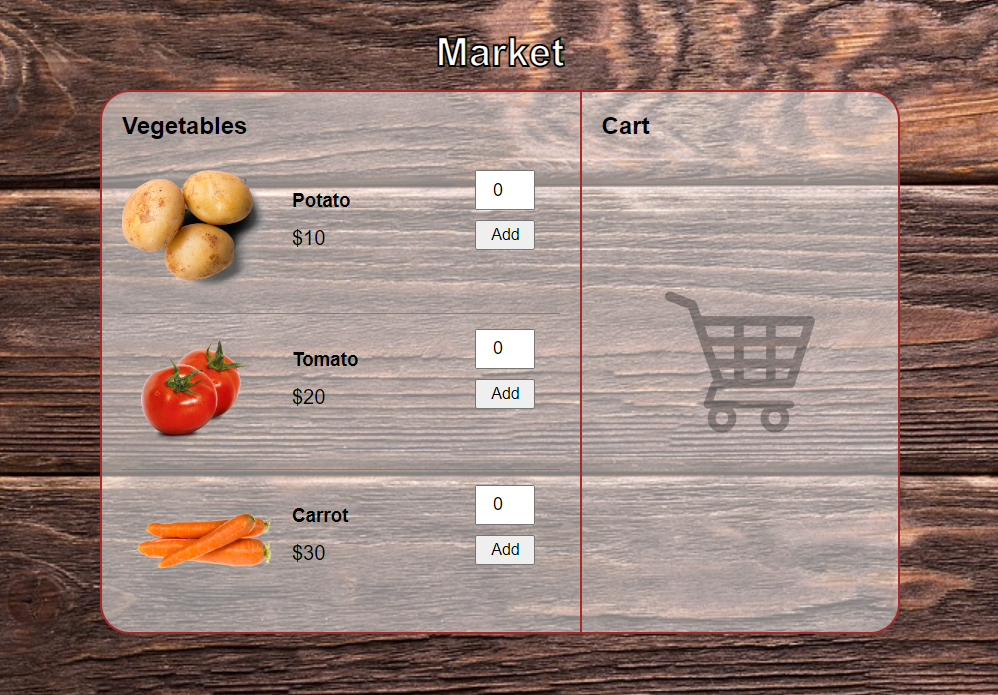

# 🥕 Vege Shop

Welcome to the **Vege Shop** repository! This project is a simple and user-friendly vegetable shopping application built using basic web technologies. It allows users to browse vegetables, add them to their cart, and manage their purchases seamlessly.

## 🔗 Live Demo

Try the [Vege Shop](https://andrejilic05.github.io/Vege-Shop/) now!

## 🚀 Features

- **Product Listing**: View a list of available vegetables with their prices and images.
- **Add to Cart**: Select the quantity and add vegetables to the shopping cart.
- **View Cart**: See the selected items in the cart along with their individual prices and quantities.
- **Total Calculation**: Automatically calculates and displays the total cost of items in the cart.
- **Remove Items**: Ability to remove items from the cart and update the total cost accordingly.

## 🛠️ Technologies Used

 - **HTML**: For the structure and content of the web pages.
 - **CSS**: For styling the application, including layout, colors, and fonts.
 - **JavaScript**: For dynamic functionality such as adding items to the cart, updating the total cost, and removing items from the cart.

## 📧 Contact
For any questions or feedback, feel free to reach out:

- Email: ilicandrej2005@gmail.com
- GitHub: AndrejIlic05
